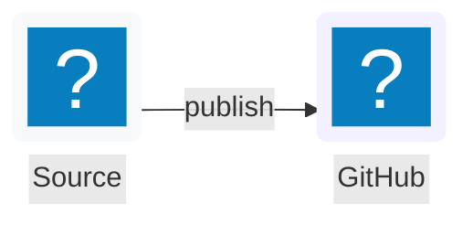

# pi-markdown-preview

Preview assistant responses and local Markdown, LaTeX, code, diff, and other text-based files from [pi](https://pi.dev) in the terminal, browser, or as PDF, with math rendering, syntax highlighting, Mermaid, and theme-aware styling.

## Screenshots

Preview adapts to your pi theme. Examples with a custom theme and the built-in defaults:

**Terminal preview (custom theme):**


**Terminal preview (default dark):**


**Terminal preview (default light):**


**Browser preview (default dark and light):**

| Default dark | Default light |
|:--:|:--:|
|  |  |

## Features

- **Terminal preview (default)** — renders markdown as PNG images displayed inline (Kitty, iTerm2, Ghostty, WezTerm). Long responses are split across navigable pages at block boundaries when possible, with a fixed-height fallback for oversized content.
- **Browser preview** — opens rendered HTML in your default browser as a single continuous scrollable document, with optional completion-level auto-refresh and response navigation via `--watch` (`-w`)
- **PDF export** — exports markdown to PDF via pandoc + LaTeX and opens it in your default PDF viewer
- **LLM-callable artifact export** — lets pi render the latest response, supplied Markdown/LaTeX, or a local file to PDF, HTML, or PNG files for remote/headless workflows such as Telegram delivery
- **Mermaid diagrams** — renders ` ```mermaid` code blocks as SVG diagrams in terminal/browser previews, and as high-quality vector diagrams in PDF export when Mermaid CLI is available
- **LaTeX/math support** — renders `$inline$`, `$$display$$`, `\(...\)`, and `\[...\]` math via MathML with selective MathJax fallback for pandoc-unsupported browser/terminal equations, or native LaTeX (PDF)
- **Syntax highlighting** — fenced code blocks in markdown and standalone code files are rendered with theme-aware syntax colouring via pandoc. Supports 50+ languages including TypeScript, Python, Rust, Go, C/C++, Julia, and more.
- **Annotation marker highlighting** — inline `[an: ...]` markers are highlighted in terminal/browser/PDF previews as note-only chips (`...`, without the `[an: ]` wrapper) outside code blocks; long notes wrap correctly in PDF instead of running off the page
- **Theme-aware** — matches your pi theme (dark/light inference, export page/card colours, Markdown colours, accent colours, syntax colours)
- **Response picker** — select any past assistant response to preview, not just the latest
- **File preview** — preview arbitrary Markdown files (including `.md`, `.mdx`, `.rmd`, and lightweight `.qmd` documents), LaTeX `.tex` files, diff/patch files, or code files (`.py`, `.ts`, `.js`, `.rs`, etc.) from the filesystem. Markdown HTML comments are omitted outside code, local image/PDF figures and basic Quarto/pandoc-crossref figure references are supported, and no Quarto computation is executed. LaTeX files are rendered as documents with full math and sectioning; diff files are rendered with coloured add/remove lines; code files are rendered with syntax highlighting. Use Quarto itself when full Quarto project, filter, subfigure, chapter-aware numbering, or execution semantics are required.
- **Caching** — rendered pages are cached for instant re-display; refresh (`r`) bypasses cache

## Prerequisites

- [Pandoc](https://pandoc.org/installing.html) (`brew install pandoc` on macOS)
- For terminal preview (`/preview` default): a Chromium-based browser executable (Chrome, Brave, Edge, Chromium). `puppeteer-core` is included as an extension dependency; no separate Puppeteer install is needed.
- For terminal inline display: a terminal with image support (Ghostty, Kitty, iTerm2, WezTerm)
- For PDF export (optional): a LaTeX engine, e.g. [TeX Live](https://tug.org/texlive/) (`brew install --cask mactex` on macOS, `apt install texlive` on Linux)
- For Mermaid-in-PDF support (optional): Mermaid CLI (`npm install -g @mermaid-js/mermaid-cli`) and a Chromium browser accessible to Mermaid CLI. PDF icon nodes require Mermaid CLI 11.6+.

### Mermaid icons

Mermaid flowcharts support optional `lucide:*` and `logos:*` icons. Keep each icon metadata declaration on one source line:



The browser renderer loads icon-pack JSON lazily from unpkg only when a diagram references that prefix, so first render requires network access. It contrast-corrects icon and shape labels against their rendered backgrounds while preserving semantic hues. PDF export forwards the same packs to Mermaid CLI 11.6+ only when a supported icon is present.

## Install

```bash
pi install npm:pi-markdown-preview
```

Or from GitHub:

```bash
pi install https://github.com/omaclaren/pi-markdown-preview
```

Or try it without installing:

```bash
pi -e https://github.com/omaclaren/pi-markdown-preview
```

## Usage

| Command | Description |
|---------|-------------|
| `/preview` | Preview the latest assistant response in terminal |
| `/preview --pick` | Select from all assistant responses |
| `/preview <path/to/file>` | Preview a Markdown, LaTeX, diff, or code file |
| `/preview --file <path/to/file>` | Preview a file (explicit flag) |
| `/preview --browser` (`-b`) | Open preview in cmux when available, otherwise the system browser |
| `/preview --font-size 14` | Preview with a custom terminal/browser font size in px (defaults: terminal 16, browser 15) |
| `/preview-browser` | Shortcut for a one-shot browser preview |
| `/preview-browser <path/to/file>` | Open a file preview in browser |
| `/preview-browser --watch` (`-w`) | Keep a browser preview updated after each completed assistant response |
| `/preview-browser --watch <path>` | Start or reopen a browser watcher for a file |
| `/preview-browser --list` | List active and starting browser preview watchers |
| `/preview-browser --stop <path>` | Stop one file watcher |
| `/preview-browser --stop --responses` | Stop the assistant-response watcher |
| `/preview-browser --stop --all` | Stop every browser preview watcher in this Pi session |
| `/preview-browser --stop` | Stop the watcher when zero or one is running; otherwise request a target |
| `/preview --pdf` | Export to PDF and open |
| `/preview-pdf` | Shortcut for `--pdf` |
| `/preview --pdf <path/to/file>` | Export a file to PDF |
| `/preview-clear-cache` | Clear rendered preview cache |
| `/preview --pick --browser` | Pick a response, open in browser |

Local images and Pandoc PDF figure embeds are supported. File previews resolve relative paths against the previewed file’s directory; assistant-response previews resolve them against pi’s current working directory. Absolute paths, `file:`, `http(s):`, and `data:` image URLs work in one-shot previews. In watch mode, exact local media references—including parent-relative paths such as `../figures/plot.png`—are rewritten to opaque authenticated routes. The general relative-resource route remains restricted beneath the preview resource directory; watch mode never exposes an arbitrary filesystem route and serves only allowlisted image types plus explicitly referenced PDF embeds.

Basic labelled-figure cross-references work consistently in terminal, browser, and PDF previews. Quarto syntax (`{#fig-elephant}` with `@fig-elephant`) and `pandoc-crossref` syntax (`{#fig:elephant}` with `@fig:elephant`) produce numbered captions and clickable **Figure N** references. This lightweight filter handles standalone captioned images and exact single references only; missing, duplicate, compound, or qualified references remain visibly unresolved. It does not emulate Quarto subfigures, project filters, chapter-aware numbering, or execution.

The short response-watch forms are `/preview-browser -w` and `/preview -b -w`. Use `/preview-browser -w ./report.md` or `/preview -b -w --file ./report.md` to watch a file. Quoted paths are supported; `--file` also makes reserved or dash-prefixed filenames explicit.

When pi is running inside cmux, browser previews automatically open as a focused cmux browser split in the caller’s workspace. If cmux is unavailable or declines the request, the normal system-browser opener is used instead.

The watch server removes its bootstrap token from the address bar after setting a browser-specific session cookie. Consequently, copying the cleaned address-bar URL into another browser is intentionally rejected. Use the watch toolbar’s **Copy link** control to request a fresh authenticated URL; it copies directly when browser permissions allow and otherwise selects the URL for manual copying.

Response watch mode is deliberately completion-level rather than token-streaming: it performs one canonical Pandoc render after each settled agent run, and only for a new or changed latest assistant response. File watch mode debounces source-file changes, hashes the file contents, and renders only genuine changes; temporary read/render failures leave the last good preview visible. Linked asset changes alone do not trigger a render. Both modes use token-protected servers bound to `127.0.0.1` and stop through the browser-watch lifecycle commands or when the session shuts down. One-shot browser previews remain unchanged and do not start this server.

Up to eight browser preview watchers can run per Pi session: multiple canonical file paths plus at most one assistant-response watcher. Each has an independent loopback server, authentication token, history, resource root, render state, and cleanup lifecycle. Repeating the same source reopens its existing watcher rather than duplicating it, and file and response watchers may coexist. Use `--list` to inspect them, a path or `--responses` to stop one, and `--all` to stop every watcher. Bare `--stop` retains the convenient old behaviour when zero or one watcher exists but makes no change when several are running.

Watch history starts with the initial preview and retains up to the latest 20 completed responses or successfully rendered file versions, subject to a 32 MiB aggregate HTML cap per watcher; the newest successful revision is always retained. Use the browser’s Back/Forward buttons or the **Previous**, **Next**, and **Latest** controls to move between them. **Option/Alt+Left** and **Option/Alt+Right** are shortcuts for Previous and Next when focus is outside an editable field. Auto-follow continues while the latest preview is open; when viewing an older one, the page stays put and marks **Latest (new)** as new responses or file versions arrive. Use `/preview --pick --browser` for assistant responses from before a response watcher started.

### LLM-callable artifact export

The extension also registers a `preview_export` tool that pi can call directly. It renders Markdown/LaTeX content, a local file, or the latest assistant response to artifact files and returns their paths instead of requiring an interactive terminal/browser preview.

Supported formats:
- `pdf` — writes a PDF file using the same pandoc + LaTeX path as `/preview-pdf`
- `html` — writes a standalone rendered HTML preview
- `png` — writes one PNG per rendered preview page, appending `-1-of-N`, `-2-of-N`, etc. for multi-page output

The tool accepts optional `outputPath`, `fontSizePx`, `resourcePath`, and `open` arguments. By default it only writes files and returns paths, so another integration (for example Telegram or an upload/send-file tool) can deliver them.

Example user requests pi can satisfy with `preview_export`:

```text
Make the last answer a PDF and send it to me.
Render ./report.md as HTML.
Export this markdown as PNG pages.
```

### Programmatic helper exports

Other pi extensions can import the preview helpers directly:

```ts
import {
  openPreview,
  openPreviewInBrowser,
  closeSharedPreviewBrowser,
} from "pi-markdown-preview";
```

- `openPreview(ctx, markdownOverride?, resourcePath?, isLatex?, fontSizePx?)` opens the inline terminal preview.
- `openPreviewInBrowser(ctx, markdownOverride?, resourcePath?, isLatex?, fontSizePx?)` writes and opens the browser HTML preview.
- `closeSharedPreviewBrowser()` closes the shared headless Chromium instance used for terminal/PNG rendering. Importing extensions can call this from their own `session_shutdown` handler; the bundled extension also calls it on pi shutdown/reload/switch.

Additional accepted argument aliases:
- Pick: `-p`, `pick`
- File: `-f`
- Browser target: `-b`, `browser`, `--external`, `external`, `--browser-native`, `native`
- Browser watch: `--watch`, `-w` (assistant responses or one file), `--stop`
- PDF target: `pdf`
- Terminal target: `terminal`, `--terminal` (usually unnecessary because terminal is the default)
- Font size: `--font-size <px>`, `--font-size=<px>`, `--font-size-px <px>`, `--fs <px>` (10–24 px; terminal/browser previews; defaults: terminal 16, browser 15)
- Help: `--help`, `-h`, `help`
- Note: `--pick` and `--file` cannot be used together

PDF export uses Pandoc plus a LaTeX PDF engine (`xelatex` by default). The PDF preamble uses optional styling packages when they are available (including light code-block backgrounds via `framed`) and falls back to simpler output otherwise. Long-running PDF subprocesses time out after 120 seconds by default; set `PI_MARKDOWN_PREVIEW_PDF_TIMEOUT_MS` to adjust this.

To validate command docs against implementation:

```bash
npm run check:readme-commands
```

### Keyboard shortcuts (terminal preview)

| Key | Action |
|-----|--------|
| `←` / `→` | Navigate pages |
| `r` | Refresh (re-render with current theme) |
| `o` | Open current preview in browser |
| `Esc` | Close preview |

## Configuration

The LLM-callable `preview_export` tool is registered by default. To omit that tool while keeping all `/preview` commands available, set this before starting pi:

```bash
export PI_MARKDOWN_PREVIEW_REGISTER_EXPORT_TOOL=false
```

The values `0`, `false`, `no`, and `off` disable registration (case-insensitive). Unset or any other value keeps the tool enabled.

Set `PANDOC_PATH` if pandoc is not on your `PATH`:

```bash
export PANDOC_PATH=/usr/local/bin/pandoc
```

Pandoc HTML conversion is bounded to 30 seconds, 50 MiB of standard output, and 5 MiB of diagnostics so a broken subprocess cannot stall or exhaust a preview session. Stopping a browser watcher cancels its active Pandoc process tree.

Set `PANDOC_PDF_ENGINE` to override the LaTeX engine used for PDF export (default: `xelatex`):

```bash
export PANDOC_PDF_ENGINE=xelatex
```

Set `PUPPETEER_EXECUTABLE_PATH` to override Chromium detection for terminal preview rendering:

```bash
export PUPPETEER_EXECUTABLE_PATH=/path/to/chromium
```

On Windows, standard system and per-user Chrome, Edge, Brave, and Chromium installations are detected from `ProgramW6432`, `PROGRAMFILES`, `PROGRAMFILES(X86)`, and `LOCALAPPDATA`, with the common `C:` locations as fallbacks.

Terminal preview uses the known-good fixed screenshot path: 1200px Chromium viewport at device scale `2`. Set `PI_MARKDOWN_PREVIEW_DEVICE_SCALE_FACTOR` only if you want to experiment with screenshot density manually (default: `2`; range: `1`–`2.5`):

```bash
export PI_MARKDOWN_PREVIEW_DEVICE_SCALE_FACTOR=2
```

Set `MERMAID_CLI_PATH` if `mmdc` is not on your `PATH`:

```bash
export MERMAID_CLI_PATH=/path/to/mmdc
```

Set `MERMAID_PDF_THEME` for PDF Mermaid rendering (`default`, `forest`, `dark`, `neutral`; default: `default`):

```bash
export MERMAID_PDF_THEME=default
```

## Cache

Rendered previews are cached at `~/.pi/cache/markdown-preview/` by default.
When `PI_CODING_AGENT_DIR` is set, the cache is stored at `$PI_CODING_AGENT_DIR/cache/markdown-preview/` instead.
Clear it with:

```bash
/preview-clear-cache
```

Or manually:

```bash
rm -rf "${PI_CODING_AGENT_DIR:-$HOME/.pi}/cache/markdown-preview/"
```

## License

MIT
